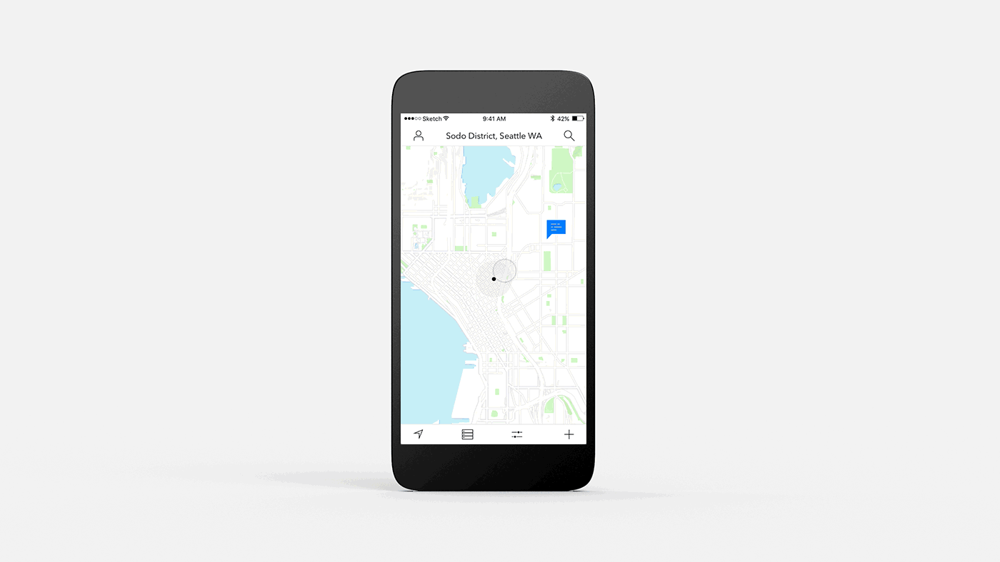

Conceptual prototype of an entirely location-based communication app.

The concept is designed to bridge the gap between the ease of social media apps and the act of putting up flyers for block parties, figuring out what that weird noise was, and figuring out what to do in a new city.

The design was inspired by the ease of checking up on the area in the Watchdogs videogame, and lightly used the bare-bones sharp-edged visual style from the game as a guide.

---

