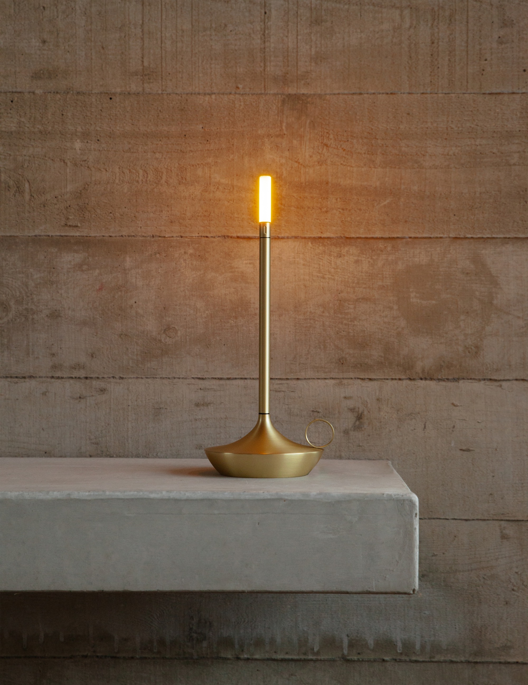
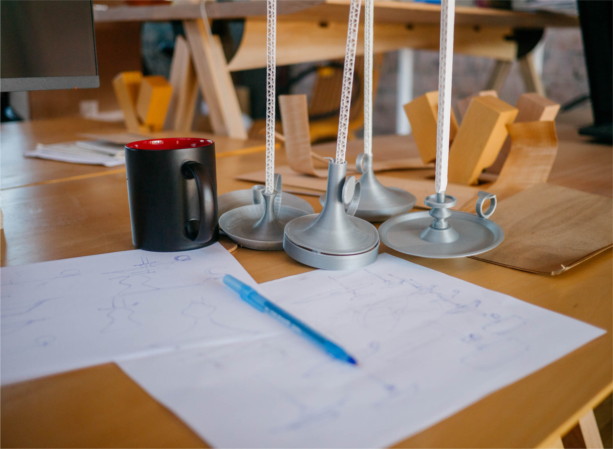
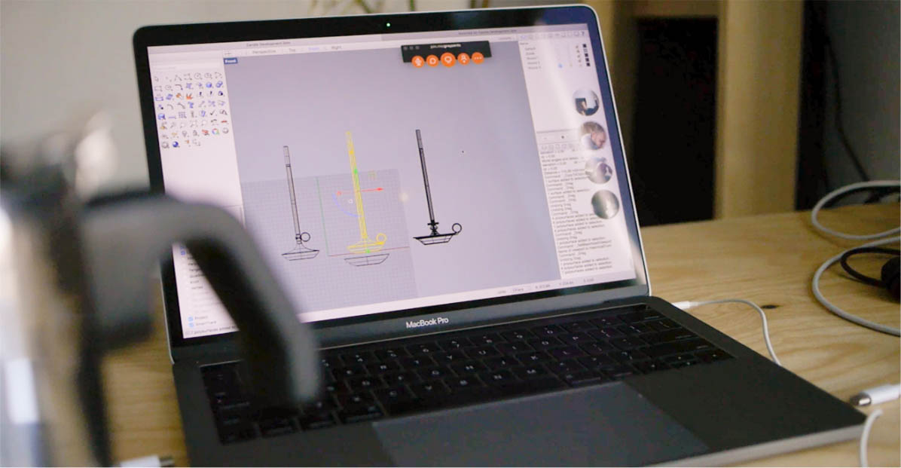
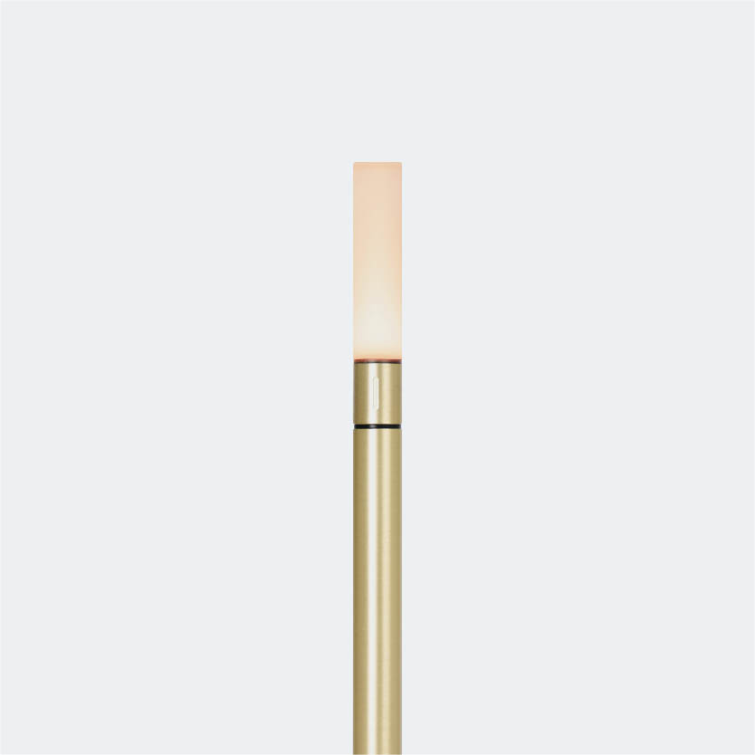

Wick design and manufacture consulting

I worked directly with [Graypants](https://graypants.com) to design and manufacture a new portable light, as the company's first entry into the consumer goods market

During production I developed a photorealistic rendering process using Blender to accurately simulate light and material finishes for prototyping

