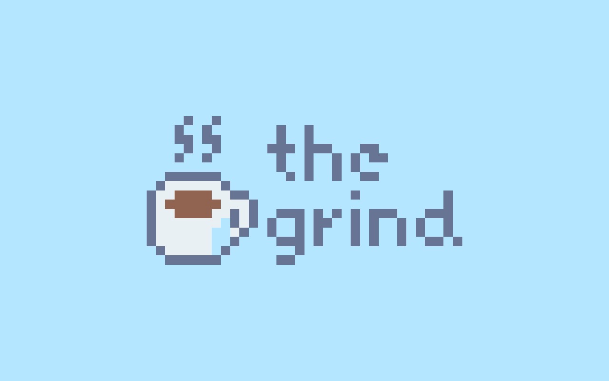
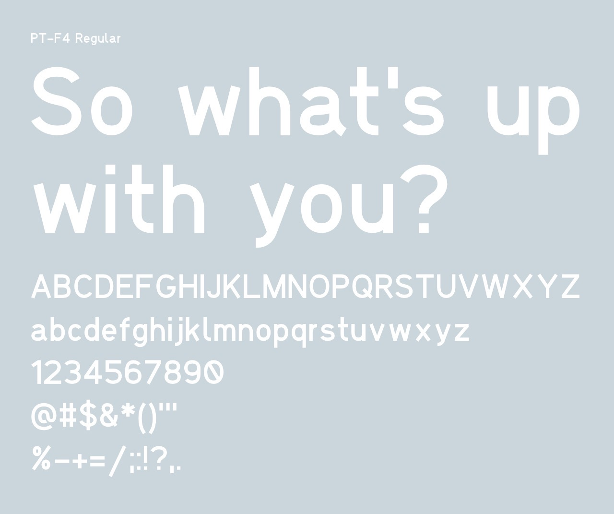
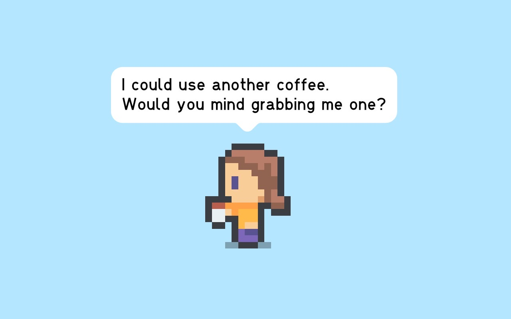
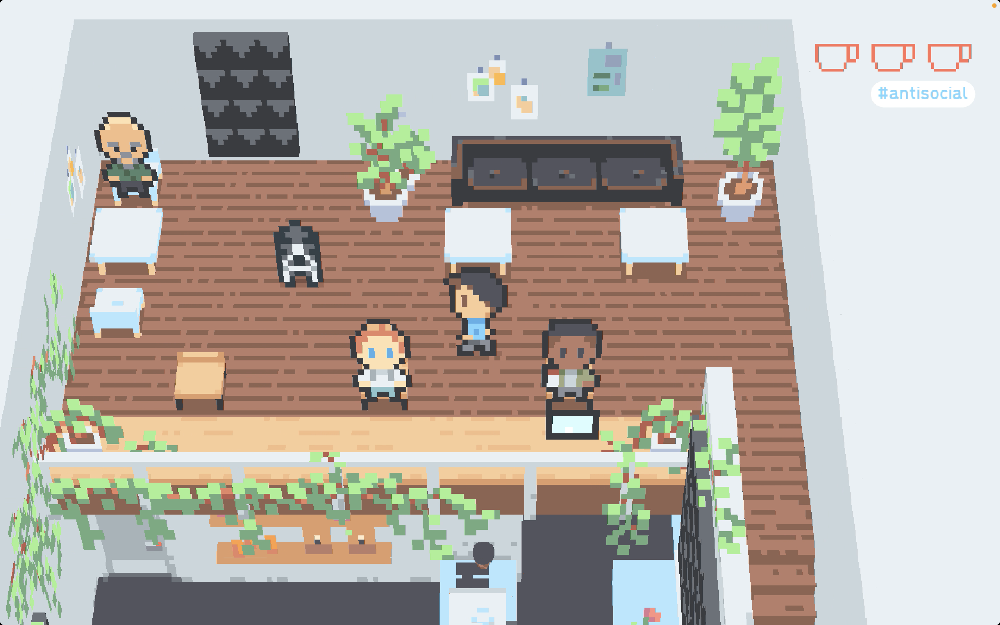
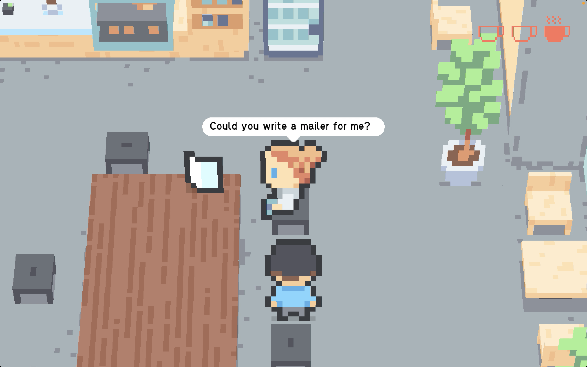
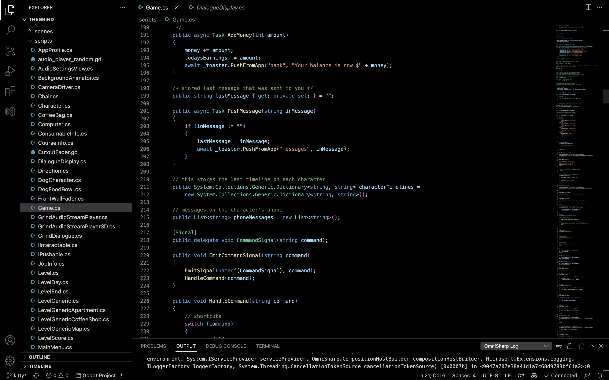
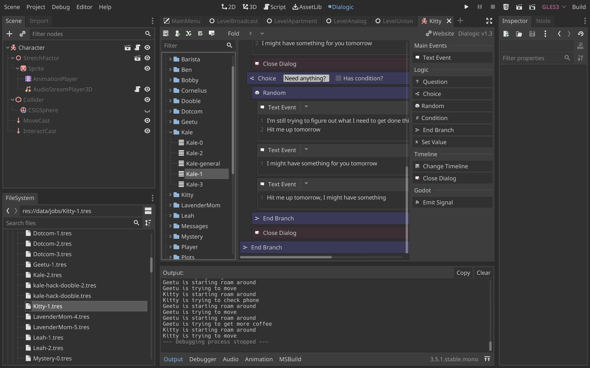
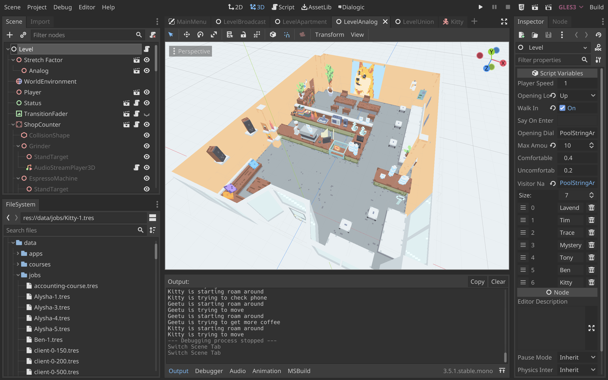

The Grind

Game design and development for a satirical parody of the experience of freelancing at coffee shops. The game takes place in three coffee shops based on actual coffee shops in Seattle Washington and follows newcomer trying to pay off their expensive rent by taking various freelance jobs from the locals and managing their own productivity.

The game is written in C# utilizing the Godot Engine. Initially the game was written in Unity.

***

