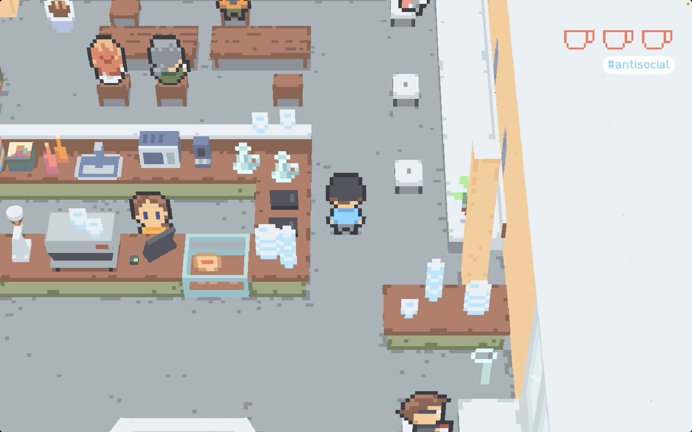

Game design and development for a satirical parody of the experience of freelancing at coffee shops. The game takes place in three coffee shops based on actual coffee shops in Seattle Washington.

The process involved creating a system for the 2.5D characters along with the 3D artwork for the maps, building a custom typeface for the dialogue, and writing scripts for handling branching dialogue along with general gameplay. The game was written in C# using the Godot and Unity engines.

---

