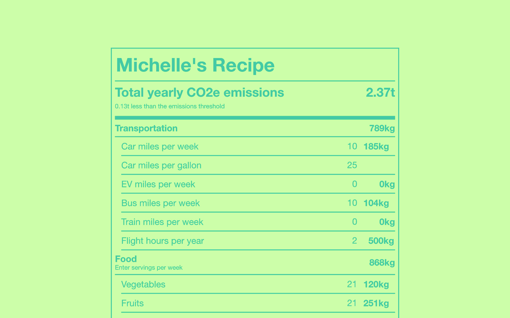
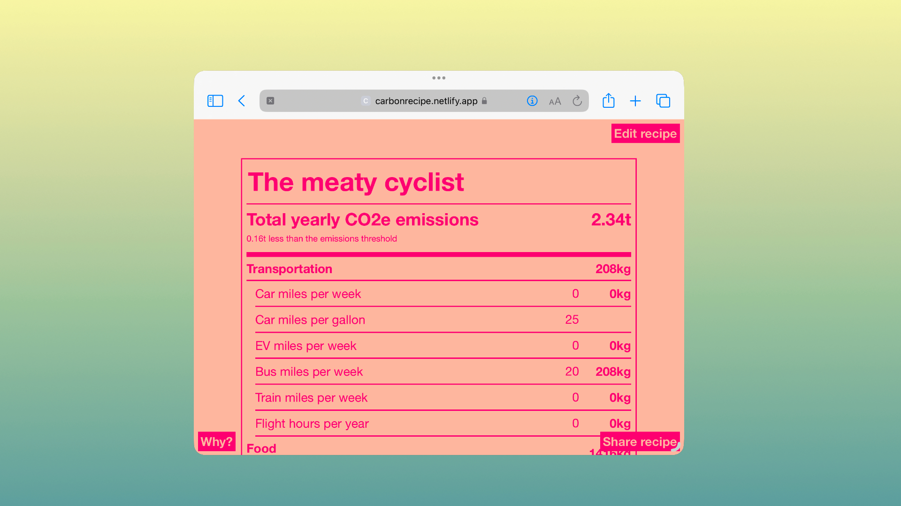
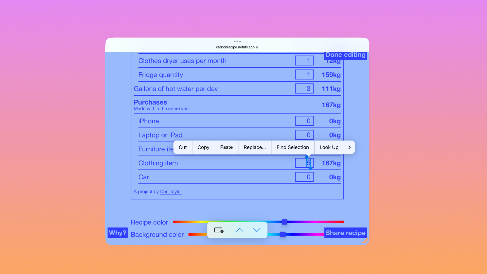

Carbon Recipe

In the interest of spreading awareness about carbon emissions and a desire to bring a deeper fulfilling value to our everyday decisions, I created a [web app](https://carbonrecipe.netlify.app/) that allows anyone to easily see and experiment with their carbon footprint. 

Many emissions calculators I used asked difficult questions involving locating utility bills and making numerical calculations that couldn't easily be estimated on the spot. The results commonly didn't identify specific changes that could be made and instead advised general things like using reusable bags and paying for carbon offsets.

I wanted something that immedietly showed me the heavy hitters behind my own impact and encouraged me to try things.

***

***

The app was originally prototyped using a massive spreadsheet with calculations pulled from meticulous searches, verified databases, and ChatGPT (I promise it was accurate).

***

***

Users can customize their own recipe, which is saved to their browser's local storage. They can also share their recipe using a code that is dynamically generated in the URL bar.

[Try it out here](https://carbonrecipe.netlify.app/)